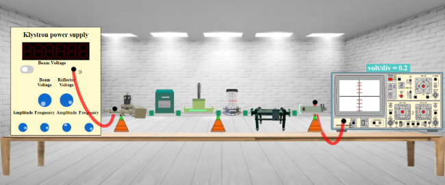

## Procedure 

To perform the experiment follow the steps:  
  
**Step-1:** Click on Components button for components to pop up.  
  
**Step-2:** Click on the "Components", drag them to the test bench and place them as shown in fig. 1.  
  

**Fig. 1 Setup to study the characteristics of Reflex Klystron**

  

**Step-3:** After placing the components on the test bench, connect the wires accordingly.  
  
**Step-4:** If your connections are correct then you may continue to take down the readings, if not then click on "Reset Button" and try it again.  
  
**Step-5:** Move the "Beam Voltage" knob and set it to 250 or above to record your readings.  
  
**Step-6:** Toggle the switch button and move the "Reflector Voltage" knob to set the reflector voltage to maximum negative value.  
  
**Step-7:** As soon as you start varying the reflector voltage you will observe a waveform on CRO.  
  
**Step-8:** Keep varying the "Reflector voltage" till you get square waveform on CRO.  
  
**Step-9:** As soon as you observe square waveform on CRO (You will get square waveforms at these values 197 (starting point), 205 (peak point) and 215 (ending point) of voltage.), click on "Micro-ammeter" button for current values.  
  
**Step-10:** Note down the value for current in input box for Current.  
  
**Step-11:** Click on "Add to table" button to add values of Reflector Voltage and Power in a table.  
  
**Step-12:** Move the "Reflector Voltage" knob for different reading.  
  
**Step-13:** Repeat the process for almost 3 different readings (i.e for all three:** starting point of signal, peak point, ending point of signal) as you did for the first reading.  
  
**Step-14:** Click on "Plot" button to plot a graph as per your readings.  
  
**Step-15:** If you want to save the graph click on the camera icon just above the graph.  
  
**Step-16:** Click on "Close" button to go back to the page of readings.  
  
**Step-17:** Now click on "Print" button to get a pdf of all the readings and connections for this experiment.

