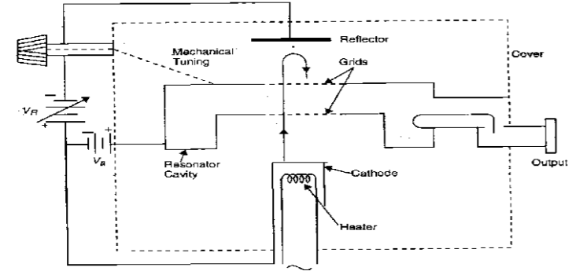

### Introduction

The Reflex Klystron makes use of velocity modulation to transform a continuous electron beam into microwave power. Electron emitted from the cathode are accelerated and passed through the positive resonator towards negative reflector, which retards and, finally, reflects the electron; and the electron turns back through the resonator. Suppose an hf-field exists between the resonator, the electron traveling forward will be accelerated or retarded, as the voltage at the resonator changes in amplitude. The accelerated electrons leave the resonator at an increased velocity and the retarded electrons leave at the reduced velocity. The electrons leaving the resonator will need different time to return, due to change in velocities. As a result, returning electrons group together in bunches. As the electron bunches pass through resonator, they interact with voltage at resonator grids. If the bunches pass the grid at such time that the electrons are slowed down by the voltage, energy will be delivered to the resonator; and Klystron will oscillate. Fig. 1 shows the schematic of a typical Klystron tube. Fig. 2 shows the relationship between output power, frequency and reflector voltage. The frequency is primarily determined by the dimension of resonant cavity. Hence, by changing the volume of resonator, mechanical tuning range of Klystron is possible. Also, a small frequency change can be obtained by adjusting the reflector voltage. This is called Electronic Tuning Range. The same result can be obtained, if the modulation voltage is applied on the reflector voltage VR as shown in the Fig.  

**Fig. 1 Schematic diagram of a typical Klystron**

#### Component Used for Characteristics of Reflex Klystron

1. **Klystron Power Supply**  
Provides the necessary high voltage to the klystron tube, powering the electron beam and ensuring proper operation of the device.

2. **Klystron Mount**  
A fixture that securely holds the klystron in place during experimentation, ensuring stable operation and proper alignment with other components.

3. **Isolator**  
Prevents reflected signals from returning to the klystron, protecting it from potential damage and ensuring stable operation by maintaining unidirectional signal flow.

4. **Variable Attenuator**  
Allows for precise control of the signal power reaching the klystron, enabling adjustments to observe the effect of power levels on the klystron’s performance.

5. **Frequency Meter**  
Measures the output frequency of the klystron, allowing for precise tuning and characterization of the device across its operating range.

6. **Slotted Line**  
A measurement tool used to visualize standing wave patterns and measure the voltage standing wave ratio (VSWR) along a transmission line, helping to analyze the output of the klystron.

7. **Detector Mount**  
Holds the detector, which measures the output signal from the klystron, allowing for the observation of the output power and other characteristics.

8. **Cathode Ray Oscilloscope (CRO)**  
Visualizes the output signal waveforms, providing insight into the frequency, amplitude, and phase characteristics of the klystron output.

9. **Micro Ammeter**  
Measures small currents, typically from the output of the klystron or the detector, allowing for accurate readings of current levels for performance analysis.  

These components work together to facilitate the measurement and characterization of the reflex klystron’s performance.

#### Block Diagram
    

**Fig. 2 Bench setup for Characteristics of Reflex Klystron**

There are two configurations for a low-powered klystron. One is a low-power microwave oscillator (Reflex Klystron) and the second is a low-power microwave amplifier (Two Cavity Klystron or Multi Cavity Klystron).

